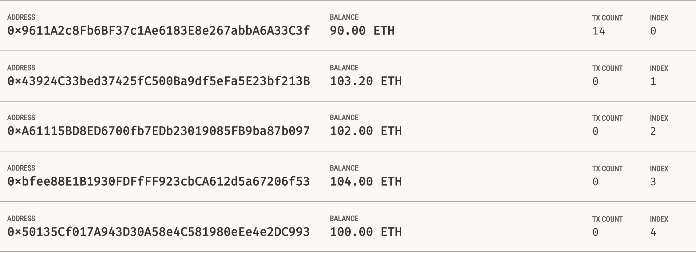

# Krypto Jobs

Unit 19 Assignment

Application that connects to blockchain (*Ganache*), sends transactions, and displays balances.

## Application

### Requirements

#### Libraries

* [Streamlit](https://streamlit.io/)
* [web3](https://web3py.readthedocs.io/en/stable/)
* [bip44](https://github.com/kigawas/python-bip44)

```commandline
pip install streamlit
pip install web3
pip install bip44
```

#### Blockchain

**Ganache**: [Github](https://github.com/trufflesuite/ganache) / [Desktop GUI](https://trufflesuite.com/ganache/)

### Example

Deployed local **Ganache** blockchain. Test transactions with `streamlit`.

Ganache account balance:


Ganache transaction history:


The five Ganache wallets used for candidates:


Streamlit transaction:


## Code 

Starter code provided by edX
