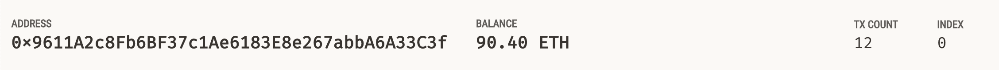
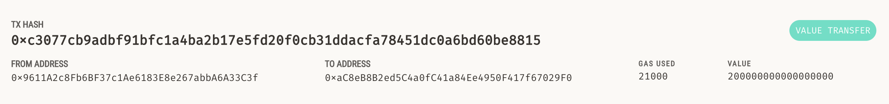
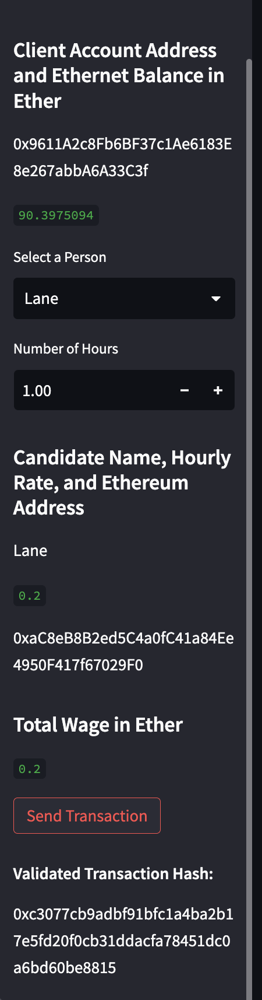

# Krypto Jobs

Unit 19 Assignment

Application that connects to blockchain (*Ganache*), sends transactions, and displays balances.

## Application

### Example

Deployed local **Ganache** blockchain. Test transactions with `streamlit`.

Ganache account balance:

Ganache transaction history:

Streamlit transaction:

## Code 

Starter code provided by edX
